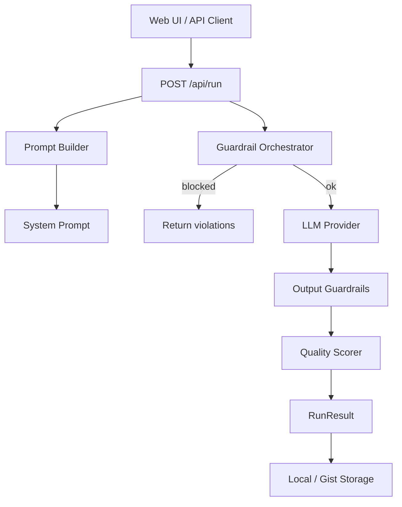

# PromptForge

**Open-source prompt engineering studio with guardrails, multi-provider LLM support, and a self-hosted FastAPI backend.**

PromptForge helps you build, run, score, and save prompts with built-in safety checks — PII scanning, injection detection, token limits, and output validation. Use cloud APIs (Anthropic, OpenAI), run models locally with Ollama, or connect any OpenAI-compatible endpoint.

[](LICENSE)
[](https://www.python.org/downloads/)
[](https://fastapi.tiangolo.com/)

---

## Table of Contents

- [Features](#features)
- [Architecture](#architecture)
- [Tech Stack](#tech-stack)
- [Prerequisites](#prerequisites)
- [Installation](#installation)
- [Configuration](#configuration)
- [Running the App](#running-the-app)
- [Docker](#docker)
- [Web UI](#web-ui)
- [API Reference](#api-reference)
- [Guardrails](#guardrails)
- [LLM Providers](#llm-providers)
- [Project Structure](#project-structure)
- [Testing](#testing)
- [Development](#development)
- [Open Source](#open-source)
- [License](#license)

---

## Features

### Prompt Engineering Engine
- **Role-aware system prompts** — senior dev, PM, executive, teacher, DevOps, data scientist, and custom roles
- **Tone & format control** — neutral, formal, friendly, technical, concise, creative; output as plain text, bullets, JSON, Markdown, and more
- **Context ingestion** — upload PDF, DOCX, TXT, or images to inject document context
- **Prompt quality scoring** — automatic 0–100 score with breakdown after each run

### Guardrails Engine
- **PII scanner** — detects API keys, emails, credit cards, SSNs, and more (blocks secrets, warns on other PII)
- **Injection guard** — blocks jailbreak and prompt injection attempts
- **Token limiter** — estimates and truncates input to stay within limits
- **Hallucination guard** — injects uncertainty instructions and flags suspicious claims in output
- **Output validator** — detects bypass language and optional code-in-output rules

### Multi-Provider LLM Support
| Provider | Models (examples) | API key required |
|----------|-------------------|------------------|
| **Anthropic** | `claude-haiku-4-5-20251001`, Sonnet, Opus | Yes |
| **OpenAI** | `gpt-4o-mini`, `gpt-4o` | Yes |
| **Ollama** | `llama3.2`, `mistral`, `llava` | No (local) |
| **Compat** | Any OpenAI-compatible endpoint | Optional |

### Storage
- **Local** — save runs as JSON or YAML to disk
- **GitHub Gist** — export prompts as private gists

---

## Architecture



**Pipeline steps for each run:**
1. Build system prompt (role + tone + format + context + guardrail injections)
2. Run input guardrails (PII → injection → token limit)
3. Call the configured LLM provider
4. Run output guardrails (PII → bypass detection → hallucination signals)
5. Score the run and return a full `RunResult`

---

## Tech Stack

| Layer | Technology |
|-------|------------|
| Backend | Python 3.11+, FastAPI, Uvicorn |
| Validation | Pydantic v2, pydantic-settings |
| LLM SDKs | Anthropic SDK, OpenAI SDK, httpx (Ollama) |
| Documents | PyMuPDF, python-docx, Pillow |
| Storage | JSON/YAML files, GitHub Gist API |
| Frontend | Jinja2 templates, vanilla JavaScript |
| Tests | pytest, pytest-asyncio, respx |

---

## Prerequisites

- **Python 3.11+** (for local install)
- **Git**
- At least one LLM backend:
  - Anthropic and/or OpenAI API keys, **or**
  - [Ollama](https://ollama.com/) installed locally, **or**
  - Any OpenAI-compatible server (vLLM, LM Studio, etc.)
- **Docker Desktop** (optional, for containerized deployment)

---

## Installation

### 1. Clone the repository

```bash
git clone https://github.com/SRIKALYAN03/Prompt-Forage.git
cd Prompt-Forage
```

### 2. Create a virtual environment

**Windows (PowerShell):**
```powershell
python -m venv venv
venv\Scripts\activate
```

**macOS / Linux:**
```bash
python3 -m venv venv
source venv/bin/activate
```

### 3. Install dependencies

```bash
pip install -r requirements-dev.txt
pip install -e .
```

### 4. Configure environment variables

```bash
# Windows
copy .env.example .env

# macOS / Linux
cp .env.example .env
```

Edit `.env` and add your API keys (see [Configuration](#configuration) below).

---

## Configuration

Copy [`.env.example`](.env.example) to `.env`. **Never commit `.env` to GitHub.**

| Variable | Required | Default | Description |
|----------|----------|---------|-------------|
| `APP_NAME` | No | `PromptForge` | Application name |
| `DEBUG` | No | `false` | Enable debug / hot reload |
| `HOST` | No | `0.0.0.0` | Server bind host |
| `PORT` | No | `8000` | Server port |
| `ANTHROPIC_API_KEY` | For Claude | — | [Anthropic API key](https://console.anthropic.com/) |
| `OPENAI_API_KEY` | For GPT | — | [OpenAI API key](https://platform.openai.com/api-keys) |
| `OLLAMA_BASE_URL` | No | `http://localhost:11434` | Ollama server URL |
| `OLLAMA_DEFAULT_MODEL` | No | `llama3.2` | Default Ollama model |
| `CUSTOM_ENDPOINT_URL` | For compat | — | OpenAI-compatible base URL |
| `CUSTOM_ENDPOINT_KEY` | No | — | API key for compat endpoint |
| `CUSTOM_ENDPOINT_MODEL` | No | — | Model name for compat endpoint |
| `DEFAULT_TOKEN_LIMIT` | No | `4000` | Default max input tokens |
| `ENABLE_PII_SCAN` | No | `true` | Enable PII scanning |
| `ENABLE_INJECTION_GUARD` | No | `true` | Enable injection detection |
| `ENABLE_HALLUCINATION_GUARD` | No | `true` | Enable hallucination guard |
| `LOCAL_STORAGE_PATH` | No | `./prompts` | Directory for saved prompts |
| `GITHUB_TOKEN` | For Gist export | — | [GitHub PAT](https://github.com/settings/tokens) |

**Ollama URL by environment:**

| Setup | `OLLAMA_BASE_URL` |
|-------|-------------------|
| Local Python | `http://localhost:11434` |
| Docker + host Ollama | `http://host.docker.internal:11434` |
| Docker + Ollama container | `http://ollama:11434` |

Empty values (e.g. `ANTHROPIC_API_KEY=`) are treated as unset.

---

## Running the App

### Option A — Uvicorn (recommended for development)

```bash
# Activate venv first, then:
uvicorn promptforge.main:app --reload --host 0.0.0.0 --port 8000
```

### Option B — Python module

```bash
python -m promptforge.main
```

### Option C — Makefile

```bash
make run
```

Open in your browser:

```
http://localhost:8000
```

> **Note:** Use `localhost` or `127.0.0.1` — not `0.0.0.0` (that address is for server binding only).

**Health check:**
```bash
curl http://localhost:8000/health
```

**Interactive API docs:** http://localhost:8000/docs

---

## Docker

No local Python install required.

```bash
copy .env.example .env    # Windows
# cp .env.example .env    # macOS/Linux

docker compose up --build
```

Open http://localhost:8000

### With Ollama in Docker (no cloud API keys)

1. Set in `.env`:
   ```env
   OLLAMA_BASE_URL=http://ollama:11434
   ```
2. Start with the Ollama profile:
   ```bash
   docker compose --profile ollama up --build
   ```
3. Pull a model:
   ```bash
   docker exec -it promptforge-ollama ollama pull llama3.2
   ```

### Development with hot reload

```bash
docker compose -f docker-compose.yml -f docker-compose.dev.yml up --build
```

| Command | Description |
|---------|-------------|
| `docker compose up --build` | PromptForge only |
| `docker compose --profile ollama up` | PromptForge + Ollama |
| `docker build -t promptforge .` | Build image manually |

Saved prompts persist in the Docker volume `promptforge-data`.

---

## Web UI

The built-in UI at http://localhost:8000 lets you:

1. Select **role**, **tone**, and **output format**
2. Choose an **LLM provider** and model
3. Upload a **document** for context (PDF, DOCX, TXT, images)
4. Enter your **prompt** and click **Run Prompt**
5. View the **score**, **response**, and any **guardrail violations**
6. **Save** the result locally

---

## API Reference

### `GET /health`

Returns server status.

```json
{ "status": "ok", "version": "0.1.0" }
```

---

### `POST /api/run`

Run the full prompt pipeline.

**Example request (Anthropic):**

```json
{
  "role": "senior_dev",
  "tone": "technical",
  "output_format": "bullet_points",
  "user_message": "Explain how JWT authentication works.",
  "context": null,
  "guardrail_config": {
    "pii_scan": true,
    "injection_detect": true,
    "token_limit": 4000,
    "hallucination_guard": true,
    "pii_output_scan": true,
    "bypass_detect": true,
    "no_code": false
  },
  "provider_config": {
    "provider_type": "anthropic",
    "model": "claude-haiku-4-5-20251001"
  }
}
```

**Example request (Ollama — no API key):**

```json
{
  "role": "teacher",
  "tone": "friendly",
  "output_format": "numbered_list",
  "user_message": "Explain recursion simply.",
  "provider_config": {
    "provider_type": "ollama",
    "base_url": "http://localhost:11434",
    "model": "llama3.2"
  }
}
```

**Roles:** `senior_dev`, `junior_dev`, `product_manager`, `executive`, `data_scientist`, `teacher`, `devops`, `custom`

**Tones:** `neutral`, `formal`, `friendly`, `technical`, `concise`, `creative`

**Output formats:** `plain_text`, `bullet_points`, `numbered_list`, `json`, `markdown`, `table`

**Provider types:** `anthropic`, `openai`, `ollama`, `compat`

---

### `POST /api/upload`

Upload a document or image for context extraction.

```bash
curl -X POST http://localhost:8000/api/upload \
  -F "file=@document.pdf"
```

**Response:**
```json
{
  "context_text": "Extracted text from document...",
  "image_base64": null,
  "filename": "document.pdf",
  "file_type": "application/pdf"
}
```

Supported: PDF, DOCX, TXT, and images (PNG, JPEG, etc.).

---

### `POST /api/save/local`

Save a run result to local disk.

```json
{
  "run_result": { "...": "RunResult object from /api/run" },
  "name": "JWT Explanation",
  "tags": ["security", "auth"],
  "format": "json"
}
```

---

### `POST /api/save/gist`

Save a run result to a GitHub Gist.

```json
{
  "run_result": { "...": "RunResult object" },
  "github_token": "ghp_your_token",
  "name": "My Prompt Run",
  "public": false
}
```

---

### `GET /api/history`

List all locally saved prompts.

---

### `GET /api/providers/ollama/models`

List available models from an Ollama instance.

```bash
curl "http://localhost:8000/api/providers/ollama/models?base_url=http://localhost:11434"
```

---

## Guardrails

| Guardrail | Input | Output | Severity |
|-----------|-------|--------|----------|
| **PII Scanner** | Scans user message + context | Scans LLM response | `block` for API keys, `warn` for email/phone |
| **Injection Guard** | Detects jailbreak patterns | Detects bypass language | `block` |
| **Token Limiter** | Truncates oversized input | — | `warn` |
| **Hallucination Guard** | Adds uncertainty instructions | Flags suspicious claims | `warn` |
| **Output Validator** | — | Bypass + optional no-code | `block` / `warn` |

Input guardrails run in order: **PII → Injection → Token limit**.  
If any `block` severity violation is found, the LLM call is skipped.

---

## LLM Providers

### Anthropic (Claude)

```env
ANTHROPIC_API_KEY=sk-ant-your-key
```

```json
{ "provider_type": "anthropic", "model": "claude-haiku-4-5-20251001" }
```

### OpenAI (GPT)

```env
OPENAI_API_KEY=sk-your-key
```

```json
{ "provider_type": "openai", "model": "gpt-4o-mini" }
```

### Ollama (local)

Install Ollama from [ollama.com](https://ollama.com), then:

```bash
ollama pull llama3.2
ollama serve
```

```json
{
  "provider_type": "ollama",
  "base_url": "http://localhost:11434",
  "model": "llama3.2"
}
```

### OpenAI-compatible (vLLM, LM Studio, etc.)

```env
CUSTOM_ENDPOINT_URL=http://localhost:8080/v1
CUSTOM_ENDPOINT_MODEL=your-model
```

```json
{
  "provider_type": "compat",
  "base_url": "http://localhost:8080/v1",
  "model": "your-model",
  "api_key": "local"
}
```

---

## Project Structure

```
Prompt-Forage/
├── promptforge/              # Python package
│   ├── main.py               # FastAPI entry point
│   ├── config.py             # Settings from .env
│   ├── api/                  # Route handlers & schemas
│   ├── core/                 # Prompt builder, models, scorer, context extractor
│   ├── guardrails/           # PII, injection, token, hallucination, output validator
│   ├── providers/            # Anthropic, OpenAI, Ollama, compat, factory
│   └── storage/              # Local JSON/YAML, GitHub Gist
├── frontend/                 # Web UI (HTML, CSS, JS)
├── tests/                    # pytest test suite (146 tests)
├── Dockerfile
├── docker-compose.yml
├── requirements.txt
├── .env.example              # Environment template (commit this)
└── .env                      # Your secrets (NEVER commit)
```

---

## Testing

```bash
# Full suite with coverage (requires >= 80%)
pytest tests/ -v --cov=promptforge --cov-fail-under=80

# Single module
pytest tests/test_pii_scanner.py -v --no-cov

# Lint & type check
ruff check promptforge/ tests/
mypy promptforge/
```

---

## Development

```bash
# Format code
make format

# Run all checks
make all
```

**Adding a new guardrail:** implement `BaseGuardrail` in `promptforge/guardrails/` and register it in `orchestrator.py`.

**Adding a new provider:** implement `BaseProvider` in `promptforge/providers/` and register it in `factory.py`.

---

## Open Source

PromptForge is MIT-licensed and self-hosted. You bring your own API keys — nothing is sent to a PromptForge cloud service.

**Safe to publish on GitHub:**
- All source code, tests, frontend, Docker files
- `.env.example` (placeholders only)

**Never publish:**
- `.env` (real API keys)
- `venv/`, `prompts/`, cache folders

---

## License

[MIT License](LICENSE) — Copyright (c) 2024 PromptForge Contributors

---

## Contributing

Contributions are welcome! Fork the repo, create a feature branch, add tests, and open a pull request.

**Repository:** [github.com/SRIKALYAN03/Prompt-Forage](https://github.com/SRIKALYAN03/Prompt-Forage)
